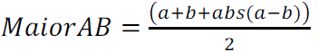

# Question:

Make a program that reads 3 integer values and present the greatest one followed by the message "eh o maior". Use the following formula:

## Input

The input file contains 3 integer values.

## Output

Print the greatest of these three values followed by a space and the message “eh o maior”.

<table>
<tr>
    <th>Input Samples</th>
    <th>Output Samples</th>
</tr>
<tr></tr>

<tr>
    <td>7 14 106</td>
    <td>106 eh o maior</td>
</tr>
<tr></tr>
<tr>
    <td></td>
    <td></td>
</tr>
<tr></tr>

<tr>
    <td>217 14 6</td>
    <td>217 eh o maior</td>
</tr>

</table>
