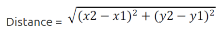

# Question

Read the four values corresponding to the x and y axes of two points in the plane, p1 (x1, y1) and p2 (x2, y2) and calculate the distance between them, showing four decimal places after the comma, according to the formula:

## Input

The input file contains two lines of data. The first one contains two double values: x1 y1 and the second one also contains two double values with one digit after the decimal point: x2 y2.

## Output

Calculate and print the distance value using the provided formula, with 4 digits after the decimal point.

<table>
<tr>
    <th>Input Samples</th>
    <th>Output Samples</th>
</tr>
<tr></tr>

<tr>
    <td>1.0 7.0 5.0 9.0</td>
    <td>4.4721  </td>
</tr>
<tr></tr>
<tr>
    <td></td>
    <td></td>
</tr>
<tr></tr>

<tr>
    <td>-2.5 0.4 12.1 7.3</td>
    <td>16.1484  </td>
</tr>
<tr></tr>
<tr>
    <td></td>
    <td></td>
</tr>
<tr></tr>

<tr>
    <td>2.5 -0.4 -12.2 7.0</td>
    <td>16.4575  </td>
</tr>

</table>
